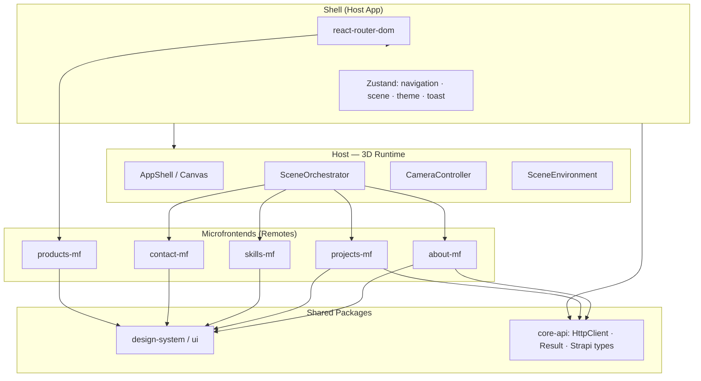
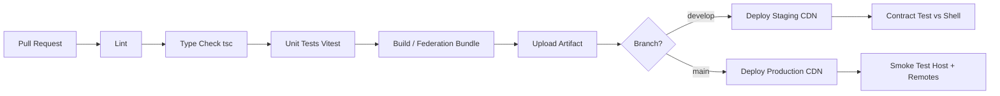

## 1. Introduction

The current Portfolio 3D frontend is a React + TypeScript SPA built with Vite, React Three Fiber, Zustand, and a feature-driven structure. It is already modular and organized by domain, which makes it a good baseline for discussing how the application could evolve into a more scalable architecture.

A microfrontend approach would only make sense if the product grew beyond a single-team setup, required independent deployments, or needed separate ownership for different domains. In the current state, the monolithic frontend remains appropriate; microfrontends are a future scale-out option.

---

## 2. Chosen Microfrontend Strategy

### Proposed strategy: Shell + Runtime Module Federation

The recommended approach is a shell application that loads feature bundles at runtime through Module Federation. The shell would keep shared responsibilities such as routing, layout, global state, and the 3D runtime, while individual features could be delivered as remote modules.

This strategy fits the project because the current architecture already has clear feature boundaries that can map naturally to independently deployed units.

### Why this strategy

- Preserves the current React + TypeScript stack
- Supports independent deployment of features
- Keeps the 3D shell stable while feature screens evolve separately
- Avoids iframe-based isolation, which would break the current integrated experience

### Main trade-offs

- More operational complexity than a single SPA
- Shared dependency versioning must be controlled carefully
- Requires contracts between shell and remotes

### Target architecture (high level)




## 3. CI/CD Pipeline Design

Today the project runs **Husky pre-commit** (`npm test`) and **commitlint** locally; there is **no CI pipeline** in the repository. A microfrontend setup requires **per-artifact pipelines** plus a **compatibility gate** on the shell.

### High-level pipeline per repository (host or remote)




### Stage descriptions


| Stage                       | Purpose                                                                 | Applies to        |
| --------------------------- | ----------------------------------------------------------------------- | ----------------- |
| **Pull Request Validation** | Block merge on failed checks                                            | All repos         |
| **Lint**                    | `eslint .` — same as current `npm run lint`                             | All repos         |
| **Type Checking**           | `tsc -b` — strict TS as in `tsconfig.app.json`                          | All repos         |
| **Unit Tests**              | `vitest run` — hooks, services, mappers per `.cursor/rules/testing.mdc` | All repos         |
| **Build**                   | Vite production build; remotes emit `remoteEntry.js`                    | Host + remotes    |
| **Staging Deployment**      | Deploy to staging CDN (e.g. `staging.about.portfolio.example`)          | Per remote + host |
| **Production Deployment**   | Promote verified artifacts; host manifest pins remote versions          | Per remote + host |


### Independent deployment model

1. **Remotes** publish versioned assets (`remoteEntry.js`, chunks) to CDN/object storage.
2. **Shell** configuration maps logical names to URLs:
  ```json
   {
     "about": "https://cdn.example.com/about-mf/1.4.2/remoteEntry.js",
     "projects": "https://cdn.example.com/projects-mf/2.1.0/remoteEntry.js"
   }
  ```
3. **Products** remote can deploy on its own schedule — the `/products` route already isolates user flow from the 3D room.
4. **Integration gate** — On shell PRs, a workflow resolves staging remotes and runs smoke tests (load portfolio, navigate About → Projects, verify Strapi-driven content).

### Deployment diagram

```
  Team A (about-mf)     Team B (projects-mf)     Team C (shell)
         │                      │                      │
         ▼                      ▼                      ▼
    CI → CDN v1.4.2        CI → CDN v2.1.0        CI → CDN host v3.0
         │                      │                      │
         └──────────────────────┴──────────────────────┘
                                │
                    Shell manifest references remote URLs
                                │
                                ▼
                         End user browser
```

**Practical note:** Start with a **monorepo** (Turborepo/Nx) containing host + remotes + `@portfolio/core-api` to simplify shared versioning; split into separate Git repos only when team autonomy requires it.

---

## 4. Scalability, Maintainability, and Performance Considerations

### Scalability


| Dimension                   | How microfrontends help this project                                                                                                  |
| --------------------------- | ------------------------------------------------------------------------------------------------------------------------------------- |
| **Independent teams**       | Squad A owns `projects-mf` (slider, Strapi populate query); Squad B owns `3d-scene` host without merge conflicts in the same Vite app |
| **Independent deployments** | Hotfix Contact form / EmailJS migration without redeploying GLB assets or camera logic                                                |
| **Feature ownership**       | Matches existing `src/features/`* folders — ownership boundaries already exist                                                        |
| **Future growth**           | New CMS section (e.g. Blog, Testimonials) = new remote + new monitor in `SceneOrchestrator`; host change is additive                  |


**Trade-off:** Cross-feature changes (e.g. global theme API) require coordinated releases or a versioned shared contract package.

### Maintainability


| Dimension                  | Benefit                                                                                                               |
| -------------------------- | --------------------------------------------------------------------------------------------------------------------- |
| **Separation of concerns** | Services and hooks stay inside each remote; shell only orchestrates composition                                       |
| **Isolated codebases**     | Smaller ESLint/TS surfaces per repo; faster CI per team                                                               |
| **Easier testing**         | Continue colocated `__tests__/` per feature; add pact-style tests for federated exports (`AboutScreen`, `fetchAbout`) |
| **Reduced coupling**       | Enforce imports: remotes must not import `@react-three/fiber` unless they own 3D UI                                   |


**Grounded constraint:** `SceneOrchestrator` today imports all screen features — the host would replace direct imports with `React.lazy(() => import('about/App'))` style federation loaders. Shared stores remain in the shell to avoid split-brain navigation state.

### Performance


| Technique               | Application to Portfolio 3D                                                                                                    |
| ----------------------- | ------------------------------------------------------------------------------------------------------------------------------ |
| **Lazy loading**        | Load `projects-mf` only when user navigates to Projects view (`cameraFocus === PROJECTS`)                                      |
| **Code splitting**      | Each remote is its own chunk; host bundle excludes About/Projects UI code                                                      |
| **Shared dependencies** | Federate `react`, `react-dom`, `zustand` as singletons; pin `three` / `@react-three/fiber` in host only                        |
| **Bundle optimization** | Products catalog (react-slick, large lists) stays out of initial 3D load path                                                  |
| **R3F-specific**        | Keep GLTF preload, `useGLTF.preload`, GPU tiering, and `<Preload all />` in host — remotes must not duplicate Three.js runtime |


**Trade-offs:**

- **Latency** — First navigation to a remote may fetch `remoteEntry.js`; mitigate with prefetch on menu hover or after loading screen completes
- **Duplicate risk** — Misconfigured federation can bundle Two.js twice; enforce shared config in CI
- **Memory** — 3D host remains heavy; microfrontends optimize **feature JS**, not **WebGL asset** weight

---

## 5. AI-Assisted Process

AI was used as a development assistant for architectural reasoning, prompt refinement, and trade-off analysis.

The tools used were:

- ChatGPT
- Gemini
- Claude
- Cursor

General usage:

- ChatGPT and Gemini were used for idea exploration, prompt refinement, and architecture discussion.
- Cursor was used as the main IDE agent.
- Claude was used for focused code review and file-level assistance.
- Project rules in `.cursor/rules/` helped guide architecture, testing, and refactoring decisions.

---

## 6. Conclusion

If the application grows into a multi-team product with independent release cycles, Module Federation is a practical microfrontend strategy because it preserves the current feature-driven structure while enabling separate deployments.

A simple CI/CD pipeline with linting, type checking, testing, build, and deployment stages is enough to support that evolution.

This proposal is scalable, maintainable, and aligned with the current frontend architecture.