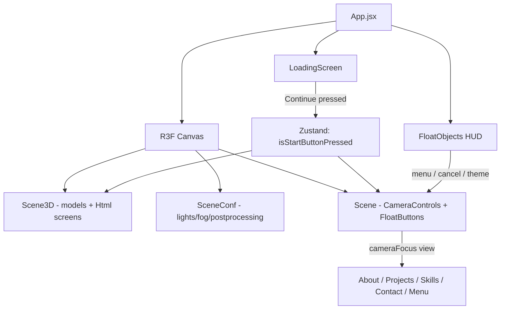

# Migration Roadmap: `portfolio-3d-legacy` → `portfolio-3d`

> **Status:** Planning document — no implementation yet.  
> **Target architecture:** Feature-Driven layout defined in [`.cursorrules/rules.md`](../.cursorrules/rules.md).  
> **Source analyzed:** `portfolio-3d-legacy/src/` (84 files).

---

## 1. Executive Summary

The legacy app is a **single-page 3D portfolio** built with React 18 + JavaScript. The user lands on a **loading/intro screen**, presses **Continue**, and enters an interactive **3D room** where a **character** sits at a desk surrounded by **monitor screens**. Navigation happens via:

- **3D float buttons** (+) positioned around the room (About, Projects, Skills, Contact)
- A **HUD menu button** (hand icon on the main monitor + floating menu/theme buttons)
- A **cancel button** (+) to return to the character view

Each section renders as an **`Html` overlay** (from `@react-three/drei`) projected onto a corresponding **GLB screen model**. Content is currently **hard-coded** in JS constants; the new project will **fetch it from APIs** using the `HttpClient` + `Result` pattern.

The migration strategy is **bottom-up**: establish core infrastructure and the 3D shell first, then layer navigation, then migrate screen features one at a time — converting CSS Modules → Tailwind and static data → typed API contracts.

---

## 2. Legacy Architecture Map

### 2.1 High-Level Flow



### 2.2 Legacy Folder Structure (conceptual)

| Legacy path | Responsibility |
|---|---|
| `App.jsx` | Canvas bootstrap, GPU/battery detection, DPR, asset preload |
| `Store/Store.js` | Monolithic Zustand store (views, camera, UI buttons, theme, GPU tier) |
| `Constants/` | `cameraControls.js`, `Times.js`, `Config.js` (timing, responsive camera, GPU presets) |
| `Components/Scene.jsx` | `CameraControls`, view switching, float button placement |
| `Components/SceneConfiguration/SceneConf.jsx` | Environment, fog, stars, reflector floor, Bloom, Light/Dark branches |
| `Components/3D_Models/Scene3D.jsx` | Orchestrates 3D props + Html screens + character lifecycle |
| `Components/3D_Models/Scenario/` | `Scenario`, `Character`, `Chair`, `Shelf`, `Cables` (GLB) |
| `Components/3D_Models/Screens/` | `*3D.jsx` — GLB mounts for each monitor |
| `Components/Screens/*/` | Html overlay UIs (About, Projects, Skills, Contact, Menu) |
| `Components/LoadingScreen/` | Progress bar, intro slide animation, Continue button |
| `Components/Floats/` | 3D navigation buttons, cancel button, floating HUD menu |
| `Components/SVG/` | Menu and theme toggle icons |
| `Animation/useScaleAnimation.jsx` | Shared scale-in/out animation hook |
| `IconsTutorials/IconTutorial.jsx` | “Drag to move” tutorial overlay |
| `StylesVariables/` + `*.module.css` | All styling (to be replaced by Tailwind) |

### 2.3 Global State (`Store.js`) — Views Enum

| View key | Triggered by | Legacy UI |
|---|---|---|
| `INITIAL` | App load | Intro camera, hand icon on menu screen |
| `CHARACTER` | Start / Cancel | Default seated view, float buttons visible |
| `MENU` | Hand icon / HUD menu button | Full-screen menu with section buttons |
| `ABOUT` | Float button / menu | Profile text + image on About monitor |
| `PROJECTS` | Float button / menu | Carousel of projects (react-slick) |
| `SKILLS` | Float button / menu | Category slider with skill cards |
| `CONTACT` | Float button / menu | Email form + social links |

---

## 3. Identified Features (Target: `src/features/`)

Each row maps to a **feature domain** in the new architecture.

| # | Feature | Legacy source | New target path | API-driven? |
|---|---|---|---|---|
| F1 | **App Shell & Canvas** | `App.jsx`, `main.jsx` | `src/App.tsx`, `src/features/app-shell/` | No |
| F2 | **Core / HTTP / Result** | *(not present)* | `src/core/api/`, `src/core/types/` | Yes (foundation) |
| F3 | **Global Store** | `Store/Store.js` | `src/store/` (split by concern) | Partial |
| F4 | **Theme (Light/Dark)** | `Store.js`, `SceneConf.jsx`, `MenuButtons`, SVG | `src/store/themeStore.ts`, `src/features/theme/` | No |
| F5 | **Performance / GPU Tier** | `App.jsx`, `Config.js`, `detect-gpu` | `src/core/performance/` | No |
| F6 | **Loading & Intro** | `LoadingScreen/`, `Times.js` | `src/features/loading/` | No (profile text may come from API later) |
| F7 | **3D Scene Environment** | `SceneConf.jsx`, `Config.js` | `src/features/3d-scene/environment/` | No |
| F8 | **3D Scenario Models** | `Scenario/`, `Shelf`, `Cables` | `src/features/3d-scene/scenario/` | No |
| F9 | **3D Character & Chair** | `Character.jsx`, `Chair.jsx`, `Scene3D.jsx` | `src/features/3d-scene/character/` | No |
| F10 | **Camera Navigation** | `Scene.jsx`, `cameraControls.js`, `FloatButton` | `src/features/3d-scene/camera/` | No |
| F11 | **Navigation HUD** | `FloatObjects`, `MenuButtons`, cancel button | `src/features/navigation/` | No |
| F12 | **3D Screen Mounts** | `*3D.jsx` in `3D_Models/Screens/` | `src/features/3d-scene/screens/` | No |
| F13 | **Menu** | `Screens/Menu/` | `src/features/menu/` | No |
| F14 | **About** | `Screens/About/` | `src/features/about/` | **Yes** |
| F15 | **Projects** | `Screens/Projects/`, `Constants/Constants.js` | `src/features/projects/` | **Yes** |
| F16 | **Skills** | `Screens/Skills/`, `Constants/Constants.js` | `src/features/skills/` | **Yes** |
| F17 | **Contact** | `Screens/Contact/`, EmailJS CDN | `src/features/contact/` | **Yes** (form submit) |
| F18 | **UI Primitives** | `IconTutorial`, SVG icons, shared animations | `src/ui/` | No |
| F19 | **Design System / Styles** | `StylesVariables/`, all CSS modules | `src/styles/`, Tailwind config | No |

### 3.1 Cross-Cutting Concerns to Refactor (not 1:1 ports)

| Legacy pattern | New rule | Action |
|---|---|---|
| Monolithic `Store.js` | Feature-driven stores | Split into `sceneStore`, `navigationStore`, `themeStore`, etc. |
| CSS Modules + global `.css` | Tailwind only | Rebuild all styles with utility classes + CSS variables |
| Static `Constants.js` data | API + `HttpClient` | Replace with typed fetch hooks returning `Result<T, AppError>` |
| `emailjs` CDN + inline submit | Result pattern in hooks | Move to backend contact API; Toast on error |
| `setState` inside `useFrame` (`Character.jsx`) | No React state in render loop | Use `useRef` + imperative material updates |
| `try/catch` in `App.jsx` (battery API) | No try/catch in UI | Wrap in core utility returning `Result` |
| Files 150–270 lines (`Scene.jsx`, `Scene3D.jsx`) | Max ~150–200 lines | Decompose into hooks + subcomponents |

---

## 4. Recommended Migration Order

Order is driven by **dependency chain**: each phase must compile and be visually testable before the next.

### Phase 0 — Project Scaffolding (Prerequisite) ✅ COMPLETE

**Goal:** Empty shell matches target folder layout.

| Step | Task | Output | Status |
|---|---|---|---|
| 0.1 | Create folder structure: `core/`, `ui/`, `features/`, `store/`, `styles/` | Directories + barrel exports | ✅ |
| 0.2 | Install and configure **Tailwind CSS v4** with dark CSS variables | `vite.config.ts`, `src/styles/globals.css` | ✅ |
| 0.3 | Install 3D + state + Embla + EmailJS deps (see §6) | Updated `package.json` | ✅ |
| 0.4 | Create `public/Models`, `public/Images`, `public/Fonts` | Directory placeholders | ✅ (copy assets before Phase 5) |
| 0.5 | Port SEO/meta + preload shell from legacy `index.html` | `index.html` | ✅ |
| 0.6 | Port `ZoomDisabler` + wrapper (TypeScript, Tailwind) | `src/ui/components/ZoomDisabler/` | ✅ |
| 0.7 | Configure `@/` path alias + `strict` TypeScript | `vite.config.ts`, `tsconfig.app.json` | ✅ |

**Exit criteria:** `npm run dev` serves a styled dark page; `npm run build` passes.

---

### Phase 1 — Core Layer (F2, F5)

**Goal:** Shared infrastructure before any feature code.

| Step | Task | Legacy reference |
|---|---|---|
| 1.1 | Implement `AppError` types + `Result<T, E>` helpers (`isOk`, `isErr`) | New |
| 1.2 | Implement `HttpClient` with typed GET/POST | New |
| 1.3 | Port `Times.js` → `src/core/constants/timing.ts` | `Constants/Times.js` |
| 1.4 | Port `Config.js` GPU presets → typed config | `Constants/Config.js` |
| 1.5 | Port `cameraControls.js` → typed responsive camera map | `Constants/cameraControls.js` |
| 1.6 | Extract GPU + battery detection into `useDeviceCapabilities` hook (core) | `App.jsx` lines 59–105 |
| 1.7 | Add Toast component in `src/ui/` | New |

**Exit criteria:** Unit-testable core utilities; no React components beyond Toast stub.

---

### Phase 2 — Global State (F3, F4)

**Goal:** Replace monolithic store with focused Zustand slices.

| Step | Task | Legacy state fields |
|---|---|---|
| 2.1 | `sceneStore` — `cameraFocus`, `gpuTier`, `isCharacterAnimStarted` | Camera + GPU |
| 2.2 | `navigationStore` — start/cancel/menu button visibility, `menuOption`, `showFloatButtons` | UI navigation |
| 2.3 | `themeStore` — `sceneTheme`, `setSceneTheme` | Theme toggle |
| 2.4 | Export `PortfolioView` enum (typed replacement for `views`) | `Store.js` |

**Exit criteria:** Stores importable; DevTools show correct defaults.

---

### Phase 3 — UI Primitives (F18)

**Goal:** Reusable pieces needed by loading, navigation, and screens.

| Step | Task | Legacy reference |
|---|---|---|
| 3.1 | `useScaleAnimation` → typed hook in `src/ui/hooks/` | `Animation/useScaleAnimation.jsx` |
| 3.2 | `IconTutorial` component (Tailwind) | `IconsTutorials/IconTutorial.jsx` |
| 3.3 | `MenuSvg`, `SwitchThemeSvg` → inline SVG components | `Components/SVG/` |
| 3.4 | Shared `ScreenHtml` wrapper (standardizes `Html` props: `distanceFactor`, `occlude`, etc.) | Repeated in every screen |

**Exit criteria:** Storybook-style manual render in a temp route (optional) or unit snapshot.

---

### Phase 4 — Loading & Intro (F6)

**Goal:** First user-visible feature; gates the 3D experience.

| Step | Task | Legacy reference |
|---|---|---|
| 4.1 | `LoadingScreen` view component (Tailwind) | `LoadingScreen/LoadingScreen.jsx` |
| 4.2 | `LoadingIcon` progress indicator | `LoadingIcon/LoadingIcon.jsx` |
| 4.3 | Slide-in/out animation (CSS → Tailwind + keyframes in config) | `Loading.css`, StartButton CSS |
| 4.4 | `useLoadingFlow` hook — progress, show Continue, dispatch `setStartButtonPressed` | Logic in `LoadingScreen` + `App.jsx` |
| 4.5 | Wire `useProgress` from drei at App level | `App.jsx` |

**Exit criteria:** Loading screen works standalone; Continue sets store flag.

---

### Phase 5 — 3D Canvas Shell (F1, F7)

**Goal:** Render the room environment without interactive screens.

| Step | Task | Legacy reference |
|---|---|---|
| 5.1 | `AppShell` — Canvas setup, even-dimension sizing, DPR from GPU tier | `App.jsx` |
| 5.2 | `SceneEnvironment` — Dark branch (default): color, fog, stars, reflector floor, Bloom | `SceneConf.jsx` |
| 5.3 | ~~Light branch~~ — **out of scope v1** (Dark-only) | — |
| 5.4 | `useEnvironmentSettings(gpuTier)` hook | `SceneConf.jsx` + `Config.js` |
| 5.5 | `<Suspense>` + `<Preload all />` | `App.jsx` |

**Exit criteria:** Empty 3D scene with floor, stars, and fog renders at 60fps on tier 1–3.

---

### Phase 6 — 3D Scenario & Character (F8, F9, F12)

**Goal:** Static room + animated character (no screen content yet).

| Step | Task | Legacy reference |
|---|---|---|
| 6.1 | Port `Scenario.jsx` (room GLB) | `Scenario/Scenario.jsx` |
| 6.2 | Port `Shelf.jsx` | `Scenario/Shelf.jsx` |
| 6.3 | Port `Character.jsx` — **refactor `useFrame` state updates to refs** | `Scenario/Character.jsx` |
| 6.4 | Port `Chair.jsx` (helmet animation) | `Scenario/Chair.jsx` |
| 6.5 | ~~`Cables.jsx`~~ — **excluded** (commented legacy code; do not port) | — |
| 6.6 | Port GLB screen mounts: `About3D`, `Projects3D`, `Skills3D`, `Contact3D`, `Menu3D` | `3D_Models/Screens/` |
| 6.7 | `SceneOrchestrator` — visibility logic from `Scene3D.jsx` (character/chair/projects/cables toggles) | `Scene3D.jsx` |
| 6.8 | `useIntroSequence` hook — intro sit animation, helmet, dissolve eyes, show screens delay | `Scene3D.jsx` + `Times.js` |

**Exit criteria:** Full room visible after Continue; character intro + sit animation plays.

---

### Phase 7 — Camera & 3D Navigation (F10)

**Goal:** User can orbit the room and click float buttons.

| Step | Task | Legacy reference |
|---|---|---|
| 7.1 | `CameraController` component with `CameraControls` ref | `Scene.jsx` |
| 7.2 | `useCameraNavigation` hook — view changes, resize handling, cancel/start flows | `Scene.jsx` (decompose) |
| 7.3 | `FloatButton` 3D component (Tailwind inner HTML) | `Floats/FloatButton.jsx` |
| 7.4 | Place float buttons at legacy positions for ABOUT, PROJECTS, SKILLS, CONTACT | `Scene.jsx` lines 244–267 |
| 7.5 | Initial camera intro animation on load | `App.jsx` + `Scene.jsx` |

**Exit criteria:** Camera moves between CHARACTER and each view; responsive breakpoints match legacy.

---

### Phase 8 — Navigation HUD (F11, F13 shell)

**Goal:** Overlay controls outside the Canvas.

| Step | Task | Legacy reference |
|---|---|---|
| 8.1 | `NavigationOverlay` — cancel button (+) | `FloatObjects.jsx` |
| 8.2 | `FloatingMenuBar` — theme toggle + open menu | `MenuButtons/MenuButtons.jsx` |
| 8.3 | Move tutorial icon (character view hint) | `FloatObjects.jsx` |
| 8.4 | `Menu` screen shell — hand button, title, empty nav slot | `Screens/Menu/Main/Menu.jsx` |
| 8.5 | `MenuButtons` — SKILLS / ABOUT / PROJECTS / CONTACT | `Screens/Menu/Buttons/` |
| 8.6 | Wire `ZoomDisablerWrapper` at app root (already ported in Phase 0) | `src/ui/components/ZoomDisabler/` |

**Exit criteria:** Full navigation loop works with **placeholder** screen content.

---

### Phase 9 — About Feature (F14) — First API Screen

**Goal:** Simplest content screen; validates Html-on-GLB + API pattern.

| Step | Task | Legacy reference |
|---|---|---|
| 9.1 | Define `AboutDto` + API contract | Hard-coded text in `About.jsx` |
| 9.2 | `useAbout()` hook — fetch via `HttpClient`, handle `Result` | New |
| 9.3 | `AboutScreen` — Background, BasicInfo, description, image | `Screens/About/` |
| 9.4 | Wire into `About3D` mount | `About3D.jsx` |

**Exit criteria:** About monitor shows API data; error shows Toast.

---

### Phase 10 — Projects Feature (F15)

**Goal:** Carousel with dynamic project list.

| Step | Task | Legacy reference |
|---|---|---|
| 10.1 | Define `ProjectDto[]` API contract | `projectsData` in Constants |
| 10.2 | `useProjects()` hook | New |
| 10.3 | `ProjectCard`, `ProjectSlider` components (Tailwind) | `ItemProject`, `ProjectsSlider` |
| 10.4 | Build `ProjectCarousel` with **Embla** — `align: 'center'`, dynamic active-slide centering (no padding slides) | New |
| 10.5 | GPU-tier animation gate (`gpuTier >= 3`) | `Projects.jsx` |
| 10.6 | Tutorial overlay on PROJECTS focus | `Projects.jsx` |
| 10.7 | Special case: hide character/chair when PROJECTS focused | `Scene3D.jsx` lines 104–108 |

**Exit criteria:** Projects carousel loads from API; slide interaction matches legacy feel.

---

### Phase 11 — Skills Feature (F16)

**Goal:** Category slider with skill cards.

| Step | Task | Legacy reference |
|---|---|---|
| 11.1 | Define `SkillCategoryDto[]` API contract | `skillsConf` in Constants |
| 11.2 | `useSkills()` hook | New |
| 11.3 | `SkillCard`, `SkillSlider`, `SkillSubtitle` | `SkillContainer`, `Subtitle`, slider |
| 11.4 | Custom prev/next arrows (SVG) | `Skills.jsx` SamplePrevArrow/NextArrow |
| 11.5 | Tutorial overlay on SKILLS focus | `Skills.jsx` |

**Exit criteria:** Skills screen loads categories from API; slider navigates correctly.

---

### Phase 12 — Contact Feature (F17)

**Goal:** Form submission via backend API (not EmailJS).

| Step | Task | Legacy reference |
|---|---|---|
| 12.1 | Port EmailJS env vars (`VITE_PUBLIC_KEY`, `VITE_SERVICE_ID`) | `.env.example` |
| 12.2 | `useContactForm()` hook — submit via `@emailjs/browser` (same fields/flow as legacy) | `Form.jsx` |
| 12.3 | `ContactForm`, `SocialLinks` components | `Form/`, `Icons/` |
| 12.4 | `ContactScreen` with pointer-events gating | `Contact.jsx` |
| 12.5 | EmailJS via npm (CDN already omitted in Phase 0 `index.html`) | `@emailjs/browser` |

**Exit criteria:** Form submits to API; success/error feedback works.

---

### Phase 13 — Integration, Polish & Cleanup

| Step | Task |
|---|---|
| 13.1 | Compose final `App.tsx` from `AppShell` + `NavigationOverlay` + `LoadingScreen` |
| 13.2 | Strict TypeScript pass — zero `any`, explicit props on all components |
| 13.3 | Performance audit — verify no `setState` in `useFrame`; `useMemo` on geometries/materials |
| 13.4 | Delete unused legacy CSS patterns; confirm no `.module.css` remain |
| 13.5 | Add error boundary for 3D context (optional, recommended) |
| 13.6 | E2E smoke test: load → continue → visit all 4 sections → cancel back |
| 13.7 | Production build size check (GLB preload strategy) |

---

## 5. Target Folder Structure (Final State)

```
src/
├── core/
│   ├── api/
│   │   ├── httpClient.ts
│   │   ├── result.ts
│   │   └── errors.ts
│   ├── constants/
│   │   ├── timing.ts
│   │   ├── cameraControls.ts
│   │   └── environmentConfig.ts
│   └── performance/
│       └── useDeviceCapabilities.ts
├── store/
│   ├── sceneStore.ts
│   ├── navigationStore.ts
│   └── themeStore.ts
├── ui/
│   ├── components/
│   │   ├── Toast/
│   │   ├── IconTutorial/
│   │   └── ScreenHtml/
│   ├── hooks/
│   │   └── useScaleAnimation.ts
│   └── icons/
│       ├── MenuSvg.tsx
│       └── SwitchThemeSvg.tsx
├── features/
│   ├── app-shell/
│   ├── loading/
│   ├── 3d-scene/
│   │   ├── environment/
│   │   ├── scenario/
│   │   ├── character/
│   │   ├── camera/
│   │   └── screens/
│   ├── navigation/
│   ├── menu/
│   ├── about/
│   ├── projects/
│   ├── skills/
│   └── contact/
├── styles/
│   └── globals.css
├── App.tsx
└── main.tsx
```

---

## 6. Dependencies: Keep, Update, or Discard

### 6.1 Production Dependencies

| Legacy package | Verdict | Notes |
|---|---|---|
| `react` / `react-dom` | **Keep (already upgraded)** | New project uses **React 19**; verify R3F compatibility before pinning |
| `@react-three/fiber` | **Keep — update** | Legacy `^8.15`; install latest v9.x compatible with React 19 |
| `@react-three/drei` | **Keep — update** | Used extensively: `Html`, `CameraControls`, `useGLTF`, `useProgress`, `Stars`, `Environment`, `MeshReflectorMaterial`, etc. |
| `three` | **Keep — update** | Legacy `^0.161`; align version with R3F peer dependency |
| `zustand` | **Keep — update** | Legacy `^4.5`; v5 is current |
| `detect-gpu` | **Keep — update** | GPU tier detection in `App.jsx` |
| `@react-three/postprocessing` | **Keep — update** | Bloom + Vignette in `SceneConf.jsx` |
| `@emailjs/browser` | **Keep** | Contact stays client-side; no backend endpoint |
| `react-slick` | **Discard** | Replaced by Embla Carousel |
| `slick-carousel` | **Discard** | CSS peer for react-slick; not needed |
| `embla-carousel-react` | **Add** | Projects + Skills sliders; active slide centered dynamically |

### 6.2 Dev Dependencies

| Legacy package | Verdict | Notes |
|---|---|---|
| `@vitejs/plugin-react` | **Keep** | Already in new project (v6) |
| `vite` | **Keep** | Already in new project (v8) |
| `eslint` + react plugins | **Keep** | New project has modern flat config |
| `@types/react` / `@types/react-dom` | **Keep** | Already present |
| `typescript` | **Add** | Required; not in legacy |
| `tailwindcss` + `postcss` + `autoprefixer` | **Add** | Mandatory per architecture rules |
| `@types/three` | **Add (optional)** | Helpful for manual Three.js work in Character |

### 6.3 Installed versions (Phase 0 — 2026-05-29)

| Package | Version |
|---|---|
| `@react-three/fiber` | ^9.6.1 |
| `@react-three/drei` | ^10.7.7 |
| `@react-three/postprocessing` | ^3.0.4 |
| `three` | ^0.184.0 |
| `zustand` | ^5.0.14 |
| `detect-gpu` | ^5.0.70 |
| `embla-carousel-react` | ^8.6.0 |
| `@emailjs/browser` | ^4.4.1 |
| `tailwindcss` + `@tailwindcss/vite` | ^4.3.0 |

### 6.4 CDN / External Scripts

| Source | Verdict |
|---|---|
| `@emailjs/browser` CDN in legacy `index.html` | **Removed** — use npm package in Phase 12 |
| Google Analytics (`gtag.js`) | **Kept** in new `index.html` |

---

## 7. API Contracts (Placeholder — to confirm with backend)

These endpoints replace static constants. Adjust paths to match your backend.

| Feature | Method | Suggested endpoint | Legacy data source |
|---|---|---|---|
| About | `GET` | `/api/about` | Hard-coded bio + image path in `About.jsx` |
| Projects | `GET` | `/api/projects` | `projectsData[]` — 4 real + 2 empty padding entries |
| Skills | `GET` | `/api/skills` | `skillsConf[]` — 4 categories, variable skills per category |
| Contact | — | *(EmailJS client-side — no API)* | Form fields: `email_id`, `message` |

> **Note:** Legacy empty project slides are **not** replicated. Embla centers the active slide dynamically regardless of project count.

---

## 8. Risk Register

| Risk | Impact | Mitigation |
|---|---|---|
| React 19 + R3F peer dependency mismatch | Build failure | Pin compatible versions in Phase 0; test Canvas mount early |
| `Character.jsx` updates state in `useFrame` | FPS drops | Refactor in Phase 6 before profiling |
| Large GLB assets | Slow first load | Keep `Preload all`; consider Draco compression |
| CSS → Tailwind on Html overlays | Visual regression | Migrate one screen at a time; compare side-by-side |
| Monolithic store hidden coupling | Bugs during split | Phase 2 mapping table; migrate consumers incrementally |
| Light theme incomplete in legacy | Visual gap | Dark is production default; Light branch exists but less tested — validate in Phase 5 |

---

## 9. Locked Scope Decisions (Confirmed)

| Topic | Decision |
|---|---|
| **Contact form** | Keep **EmailJS** (`@emailjs/browser`). Backend will not handle contact. Port existing submit logic in Phase 12. |
| **Slider** | Replace `react-slick` with **Embla Carousel** (`embla-carousel-react`). |
| **Project carousel centering** | Do **not** use fake/empty API padding slides. Configure Embla to **dynamically center the active slide** on all viewport sizes (critical for mobile). |
| **Commented legacy code** | **Do not port** any commented-out code (includes `Cables` model, disabled `ZoomDisablerWrapper` in legacy `App.jsx`, etc.). |
| **`ZoomDisabler`** | **Keep** — required for mobile. Ported early to `src/ui/components/ZoomDisabler/` (Phase 0). |
| **Light theme** | **Dark-only for v1.** Light branch in legacy `SceneConf.jsx` is out of scope until a later phase. CSS variables are dark-first for future extension. |
| **Loading screen copy** | **Static** ("Nicolas Diaz / Multimedia Engineer"). Not API-driven. |
| **Assets** | Live under `public/` (`/Models`, `/Images`, `/Fonts`). Copy from legacy deployment artifact before Phase 5. |

---

## 10. Effort Estimate (Rough)

| Phase | Estimated effort |
|---|---|
| 0 – Scaffolding | 1–2 days |
| 1 – Core | 2–3 days |
| 2 – Stores | 1 day |
| 3 – UI primitives | 1–2 days |
| 4 – Loading | 2–3 days |
| 5 – 3D environment | 2–3 days |
| 6 – Scenario + character | 4–5 days |
| 7 – Camera navigation | 3–4 days |
| 8 – Navigation HUD + menu | 2–3 days |
| 9 – About (API) | 1–2 days |
| 10 – Projects (API) | 3–4 days |
| 11 – Skills (API) | 3–4 days |
| 12 – Contact (API) | 2–3 days |
| 13 – Polish | 2–3 days |
| **Total** | **~28–40 days** (single developer, including testing) |

---

## 11. Definition of Done

- [ ] All 7 portfolio views navigable (INITIAL → CHARACTER → ABOUT / PROJECTS / SKILLS / CONTACT / MENU)
- [ ] Zero `.module.css` or legacy global CSS files in `src/`
- [ ] All API features use `HttpClient` + `Result` pattern; no `try/catch` in components/hooks UI layer
- [ ] Strict TypeScript with no `any`
- [ ] No React state updates inside `useFrame`
- [ ] Components ≤ ~200 lines; logic extracted to hooks
- [ ] Light/Dark theme toggle functional
- [ ] GPU tier degrades postprocessing/floor quality correctly
- [ ] Production build passes `tsc -b && vite build`

---

*Document generated from analysis of `portfolio-3d-legacy/src` against `portfolio-3d/.cursorrules/rules.md`.*
